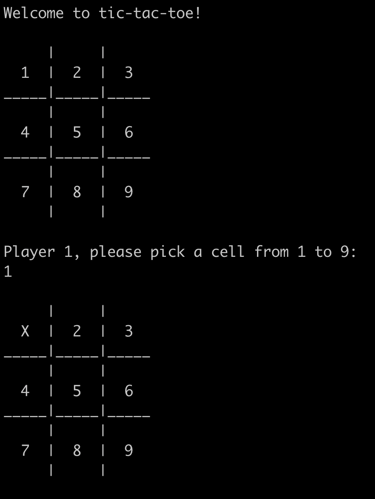

# Tic-Tac-Toe 

This project is a recreation of the game tic-tac-toe in Java that can be run in the terminal.

This project has been designed with OOP principles, with great focus being applied to SRP from SOLID.

Upon loading the game, the players will be met with an interface that displays the board with each cell numbered 1-9. The two players will alternate turns where they must enter a number from 1-9 in the terminal in order to put X or O in a cell of their choosing. Once a player has won or the game has ended in a draw, the interface will ask the players if they would like to play again or exit the program.

<p align="center">
  
</p>

<p align="center">
  <b>Fig.1 -</b> Some example output from the program. Initially, the game starts with a welcome message before asking the player to choose a cell. The player then chooses cell number 1, which updates the board by placing X in the topleft cell.
</p>

## Getting Started (macOS)

Start by cloning this repository using

```
git clone https://github.com/jmcnally17/tictactoe-java-gradle.git
```

To build the application, you can do so using [Gradle](https://gradle.org/) (one of Java's build automation tools), which can be installed via Homebrew. However, you will need to install the Java Development Kit (JDK) first, which can also be installed via Homebrew. Install and then link it by running

```
brew install java
sudo ln -sfn /opt/homebrew/opt/openjdk/libexec/openjdk.jdk /Library/Java/JavaVirtualMachines/openjdk.jdk
```

and then you are free to install Gradle with

```
brew install gradle
```

Then navigate to the [main](https://github.com/jmcnally17/tictactoe-java-gradle) directory and enter

```
gradle build
```

which creates the .class files in `build/classes/java/main` in the [app](https://github.com/jmcnally17/tictactoe-java-gradle/tree/main/app) folder.

## How To Run

While in the [main](https://github.com/jmcnally17/tictactoe-java-gradle) directory, run

```
gradle --console plain run
```

and the game should run in your terminal.

## Testing

Tests have been written using [TestNG](https://testng.org/doc/) and [Mockito](https://site.mockito.org/). To run these tests, enter

```
gradle test --rerun-tasks
```

into your terminal. This compiles the test files into .class files which are generated and run in `build/classes/java/test` in the [app](https://github.com/jmcnally17/tictactoe-java-gradle/tree/main/app) folder.

After running the tests, code coverage stats should be generated in `build/reports/jacoco` in the [app](https://github.com/jmcnally17/tictactoe-java-gradle/tree/main/app) folder using the [JaCoCo](https://www.jacoco.org/jacoco/) plugin. These are in HTML format and can be viewed by opening them in your browser.
